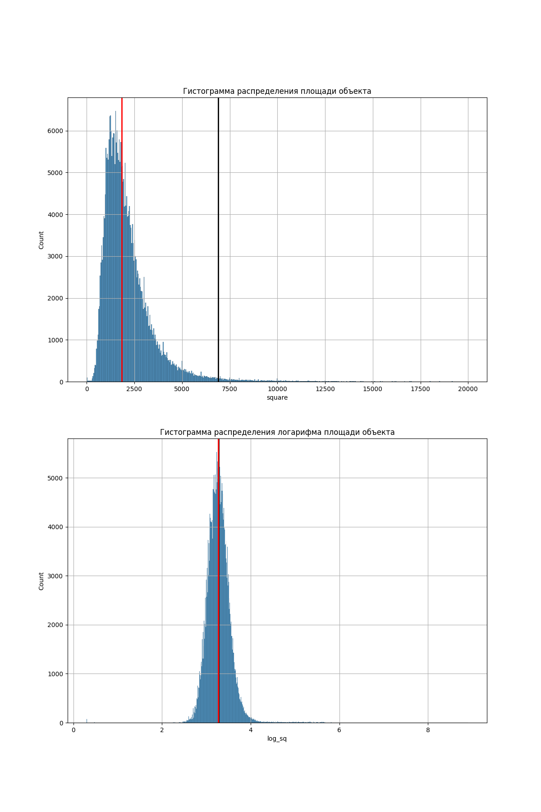

# Финальный проект первого года

## Оглавление

[1.Цель проекта](#1-Цель-проекта)

[2. Краткая информация о данных](#2-краткая-информация-о-данных)

[3. Основные этапы проекта](#3-основные-этапы-проекта)

[4. Результаты](#4-результаты)

[5. Выводы](#5-выводы)

### 1 Цель проекта

К вам обратился представитель крупного агентства недвижимости со следующей проблемой:

#### «Мои риелторы тратят катастрофически много времени на сортировку объявлений и поиск выгодных предложений. Поэтому их скорость реакции, да и, сказать по правде, качество анализа не дотягивают до уровня конкурентов. Это сказывается на наших финансовых показателях. 

#### Ваша задача — разработать сервис для предсказания стоимости домов на основе истории предложений.

:arrow_up:[к оглавлению](#оглавление)

### 2 Краткая информация о данных

При работе над проектом были использонаны следующие данные:

1. data.csv - набор данных о объектах для продажи

2. city_coord.csv - набор данных с координатами городов, где расположены объекты

3. city_population.csv - набор данных с чмсленностью населения городов

4. Набор рисунков с графиками в папке pic

5. Непосредственно сам файл с кодом обработки данных PJ_04.ipynb 

6. Используемые версии библиотек приведены в файле requirements.txt

:arrow_up:[к оглавлению](#оглавление)

### 3 Основные этапы проекта

Проект состоит из шести частей:

* Загрузка данных

* Первичная обработка признаков

* Работа с пропусками

* Анализ и преобразование признаков

* Кодирование и нормирование признаков

* Обучение модели

:arrow_up:[к оглавлению](#оглавление)

### 4 Результаты

1. Был загружен данный для работы датасет

Полученные данные содержали большое количество пропусков и ошибок. Два признака - homeFacts и schools представляли собой словари с дополнительной информацией

2. В ходе первичной обработки признаков проведена следующая работа:
   * Обработан признак status с целью удаления из данных объектов для аренды
   * Целевая переменная target переведена в численный вид и очищена от пропусков
   * Признаки private pool и PrivatePool переведены в один признак - pool
   * Признак fireplace переведен в бинарный вид (0 и 1)
   * Признаки stories - количество этажей и propertyType - тип строения были преобразованы совместно, для заполнения части пропусков в друг друге. В результате признак propertyType был преобразован в новый признак type house
   * Признак baths преобразован в bathrooms
   * Признак sqft преобразован в square и переведен в численное значение
   * На информации в признаке homeFacts были получены 7 новых признаков - Year built, Remodeled year, Heating, Cooling, Parking, lotsize, Price/sqft
   * Проведена совместная обработка признаков beds - количество спален и lotsize, для заполнения части пропусков в друг друге. В результате признак beds был преобразован в новый признак bedrooms
   * Значения признаков Heating, Cooling, Parking переведены в бинарные (0 и 1). Рассмотрено соотношение данных по наличию или отсутствию отопления, кондиционера и парковки
   
   * На информации в признаке schools были получены 3 новых признака - max_rating (максимальный рейтинг указанных школ), min_dist (минимальное расстояние до ближайшей школы), num_schools (количество указанных школ)
   * Удалены признаки mls-id, MlsId и zipcode
   * Признаки Year built и Remodeled year переведены в численный вид
3. В ходе работы с пропусками было проделано следующее:
   * Проведен анализ признаков square, Price/sqft и целевой переменной target
   
   
   
   
   На основании анализа прдолжена работа по построению модели для предсказания цены объекта
   * Пропуски в признаках 'stories', 'bathrooms' и 'bedrooms' заполнены модой
   * Проведен анализ признака 'lotsize'. 
   
   Заполнение пропусков средним или медианой могло сильно исказить данные. Пропуски признака 'lotsize' обозначены как 'no data', сам признак переведен в категориальный.
   
4. Анализ и преобразование признаков:
   * Проанализировано распределение целевой переменной и её логарифма. Распределение логарифма близко к нормальному, но таковым не является. Черной линией обозначим среднее, красной - медиану.
   
   * Проанализировано распределение признака 'square' и его логарифма. Распределение логарифма близко к нормальному, но таковым не является.
   
   * Рассмотрено распределение медианы цены в зависимости от штата
   

   Самые большие цены в Массачусетсе, Калифорнии и Нью-Йорке, а самые низкие в Мичигане

   Данные представлены 37 штатами

   На основе признаков 'city' и 'state' сформированы три новых признака - 'lat' и 'lng' - координаты места нахождения объекта, 'city_status' - статус города, где находится объект по численности населения. Информация о численности взята из википедии: 
   [ссылка на источник](https://en.wikipedia.org/wiki/List_of_United_States_cities_by_population?ysclid=meq12s9m9t860805659)
   Рассмотрено распределние количества объектов и медианы цены по типу города
   
   Наибольшее количество записей приходится на города с населением меньше 100000. Наименьшее количество записей - города Лос-Анжелес и Нью-Йорк, для которых наблюдается самое высокое значение медианы цены.
   * Рассмотрено влияние признаков 'pool', 'Heating', 'Cooling' и 'Parking' на медиану цены в зависимости от штата
   
   Распределения имеют индивидуальный характер для каждого штата

   Так и зависимость медианы цены от значения этих признаков
   
      * Наличие бассейна характеризуется большей медианной цены.
      * Наличие кондиционера и парковки незначительно влияюет на медиану цены.
      * Наличие отопления характеризуется незначительным понижение медианы цены.
   * Рассмотрено распределение объектов по году строительства 'Year built' и году реконструкции 'Remodeled year'
   
   Наибольшее количество объектов построены или реконструированы в этом веке.
   Оба признака переведены в категориальные и повторно рассмотрено распределение количества объектов от значений преобразованных признаков
   
   Рассмотрена зависимость медианы цены от значений преобразованных признаков
   
      * По году строительства наибольшее количество объектов приходится на период 2000-2020, по году реконструкции - 'no data' отсутствуют данные.
      * Наибольшая медиана цены соответствует современным домам - 2020-2025, на втором месте - 2000-2020 годов строительства.
      * По году реконструкции наибольшая медиана соответствует строениям, прошедшим реконструкцию более 100 лет назад.
   * Признак 'min_dist' переведен в категориальный - 'min_dist_to_school' и рассмотрено его распределение по количеству объектов и влияние на медиану цены
   
   У наибольшего количества объектов ближайшая школа находится на рассотянии порядка полумили. При этом само расстояние практически не влияет на медиану цены
   * Рассмотрено распределение количества объектов и медианы цены в зависимости от значения признаков 'max_rating' и 'num_schools'
   
      * Для наибольшего количества объектов указан самый высокий рейтинг - 10. И имеено ему соответствует максимальная медиана цены.
      * Для наибольшего количества объектов указано 3 школы, максимальные значения медианы цены приходится на 16 и 21 указанную школу. 
   * Рассмотрено распределение количества объектов и медианы цены в зависимости от значения признака 'type house'
   
      * Наибольшее количество записей приходится на тип 'single family home' дом для одной семьи.
      * Наибольшая медиана цены приходится на пентхаус.
   * Рассмотрено распределение количества объектов и медианы цены в зависимости от значения признака 'bathrooms' - количество ванных комнат
   
   и рассмотрено распределение количества объектов и медианы цены в зависимости от значения признака 'bedrooms' - количество спален
   
      * Наибольшее количество объектов имеет 2 этажа (возможно искажение данных из-за большого количества пропусков, заполненых модой).
      * Наблюдается рост медианы цены с ростом количества этажей с 0 до 8. Значения более 100 скорее всего ошибка заполнения данных.
      * Наибольшее количество объектов имеет 3 спальни (возможно искажение данных из-за большого количества пропусков, заполненых модой).
      * Распределение медианы по количеству спален не подвергается точному анализу.
   * Рассмотрено распределение количества объектов и медианы цены в зависимости от значения признака 'degree_lot'
   
      * Для большинства объектов значение признака соответствует 4, т.е. $10^4$.
      * Распределение медианы не носит четкой зависимости, максимум соответствует 7, т.е.  $10^7$.
5. Проведено кодирование и нормирование признаков
   * Численные признаки 'log_sq', 'lat' и 'lng' нормированы с использованием MinMaxScaler()
   * Для категориальных признаков 'stories', 'type house', 'bathrooms', 'bedrooms', 'max_rating', 'num_schools', 'degree_lot', 'city_status', 'age building', 'age remodeled', 'min_dist_to_school' использовали бинарное кодирование ce.BinaryEncoder()
   * Проведен анализ корреляции признаков по Пирсану и Спирмену
   
   
   * Сильной связи не обнаружено, за исключением бинарно закодированных признаков
6. Обучение модели состояло в следующем:
   * Проведен анализ значимости признаков методом Хи-квадрат и f_classif как с использованием целевой переменной, так и её логарифма:
   
   
      * Согласно Хи-квадрат наиболее важные признаки для целевой переменной - 'bedrooms_0', 'stories_0' и 'bedrooms_2', для логарифма целевой переменной - 'bathrooms_1', 'num_schools_1' и 'bedrooms_5'
      * Согласно f_classif как для целевой переменной, так и для логарифма целевой переменной - 'log_sq', 'Heating' и 'Cooling'
   * Датасет был разделен на тренировочную и тестовую выборку в пропорции 80/20
   * Обучена модель линейной регрессии по предсказанию целевой переменной. В качестве метрик были взяты MAE, MAPE и R2:
      * r2_score на обучающем наборе: 0.182, MAE на обучающем наборе: 515046.17, MAPE на обучающем наборе: 26.08 %
      * r2_score на тестовом наборе: 0.177, MAE на тестовом наборе: 514253.11, MAPE на тестовом наборе: 15.84 %
   * Обучена модель линейной регрессии по предсказанию логарифма целевой переменной с последующим переводом предсказанных значений из логарифма:
      * Для логарифма:
      * r2_score на обучающем наборе: 0.441, MAE на обучающем наборе: 0.229, MAPE на обучающем наборе: 0.043 %
      * r2_score на тестовом наборе: 0.432, MAE на тестовом наборе: 0.229, MAPE на тестовом наборе: 0.043 %
      * После перевода логарифма 
      * r2_score на обучающем наборе: -3.982, MAE на обучающем наборе: 381607.77, MAPE на обучающем наборе: 10.13 %
      * r2_score на тестовом наборе: -6.247, MAE на тестовом наборе: 393525.28, MAPE на тестовом наборе: 8.65 %
      * Значения метрик не впечатляют, для логарифма метрика R2 после перевода стала отрицательной, т.е. модель хуже, чем просто за предсказания взять реднее значение
   * Использовано полиномиальное преобразование признаков со степенью 2. Для предсказания обучили модель с L2-регуляризацией:
      * r2_score на обучающем наборе: 0.511, MAE на обучающем наборе: 433066.98, MAPE на обучающем наборе: 8.41 %
      * r2_score на тестовом наборе: 0.407, MAE на тестовом наборе: 441309.07, MAPE на тестовом наборе: 2.29 %
      * Наблюдаем значительное улучшение метрик
   * Использование полиномиальных признаков также улучшило метрики по предсказанию логарифма целевой переменной:
      * r2_score на обучающем наборе: 0.717, MAE на обучающем наборе: 0.163, MAPE на обучающем наборе: 0.031 %
      * r2_score на тестовом наборе: 0.706, MAE на тестовом наборе: 0.164, MAPE на тестовом наборе: 0.031 %
      * А сам перевод мягко говоря не получился:
      * r2_score на обучающем наборе: -2258663.249, MAE на обучающем наборе: 5315241.20, MAPE на обучающем наборе: 29.83 %
      * r2_score на тестовом наборе: -58873.540, MAE на тестовом наборе: 2301716.20, MAPE на тестовом наборе: 37.03 %
   * Обучена модель дерева решения для предсказания целевой переменной:
      * r2_score на обучающем наборе: 0.791, MAE на обучающем наборе: 257491.559, MAPE на обучающем наборе: 12.373 %
      * r2_score на тестовом наборе: 0.302, MAE на тестовом наборе: 283620.814, MAPE на тестовом наборе: 7.604 %
      * Полученные значения метрик лучше, чем аналогичные для простой линейной регрессии. Если сравнивать с регрессией на полиномиальных признаках, то значение MAE улучшилось, MAPE ухудшилось, а r2 лучше для обучающего набора данных, но хуже для тестового.
   * Обучена модель дерева решения для предсказания логарифма целевой переменной:
      * r2_score на обучающем наборе: 0.843, MAE на обучающем наборе: 0.114, MAPE на обучающем наборе: 0.021 %
      * r2_score на тестовом наборе: 0.742, MAE на тестовом наборе: 0.141, MAPE на тестовом наборе: 0.026 %
      * После перевода логарифма
      * r2_score на обучающем наборе: 0.919, MAE на обучающем наборе: 140368.61, MAPE на обучающем наборе: 3.74 %
      * r2_score на тестовом наборе: 0.463, MAE на тестовом наборе: 232726.26, MAPE на тестовом наборе: 5.17 %
      * Использование предсказание логарифма значительно повысило метрики, в том числе и для преобразованных значений. В дальнейшем использовался логарифм целевой переменной.
   * Построена модель случайного леса:
      * r2_score на обучающем наборе: 0.977, MAE на обучающем наборе: 0.040, MAPE на обучающем наборе: 0.008 %
      * r2_score на тестовом наборе: 0.844, MAE на тестовом наборе: 0.102, MAPE на тестовом наборе: 0.019 %
      * После перевода логарифма:
      * r2_score на обучающем наборе: 0.919, MAE на обучающем наборе: 71955.39, MAPE на обучающем наборе: 0.10 %
      * r2_score на тестовом наборе: 0.744, MAE на тестовом наборе: 170049.00, MAPE на тестовом наборе: 3.78 %
      * Использование случайного леса дает значительное улучшение метрик
   * Показано влияние признаков по 'мнению' модели:
   
      * Согласно модели наиболее важные признаки - 'log_sq' - площадь объекта, 'lag' и 'lng' - координаты места объекта. Наиболее близкие по значимости данные давал тест f_classif
   * Построена модель градиентного бустинга:
      * r2_score на обучающем наборе: 0.962, MAE на обучающем наборе: 0.058, MAPE на обучающем наборе: 0.011 %
      * r2_score на тестовом наборе: 0.846, MAE на тестовом наборе: 0.105, MAPE на тестовом наборе: 0.020 %
      * После перевода логарифма 
      * r2_score на обучающем наборе: 0.983, MAE на обучающем наборе: 74858.10, MAPE на обучающем наборе: 0.14 %
      * r2_score на тестовом наборе: 0.723, MAE на тестовом наборе: 173883.80, MAPE на тестовом наборе: 1.18 %
      * В сравнении со случайным лесом для метрик MAE и R2 наблюдается незначительное изменений, а вот MAPE уменьшилось практически в 3 раза для тестового набора данных
   * Построена модель стекинга на основе ранее использованных моделей:
      * r2_score на обучающем наборе: 0.949, MAE на обучающем наборе: 0.064, MAPE на обучающем наборе: 0.012 %
      * r2_score на тестовом наборе: 0.846, MAE на тестовом наборе: 0.105, MAPE на тестовом наборе: 0.020 %
      * После перевода логарифма 
      * r2_score на обучающем наборе: 0.940, MAE на обучающем наборе: 84136.32, MAPE на обучающем наборе: 0.16 %
      * r2_score на тестовом наборе: 0.732, MAE на тестовом наборе: 174399.20, MAPE на тестовом наборе: 0.47 %
      * Наблюдается незначительное ухудшение метрик на тренировочном наборе по сравнению со случайным лесом и бустингом, но при этом имеет место быть увеличение R2 по сравнению с бустингом и наиболее лучшие значения MAPE на тестовом наборе

:arrow_up:[к оглавлению](#оглавление)

### 5 Выводы
* Был получен набор данных по объектам недвижимости, содержащие большое количество пропусков и ошибок. Была проведена работа по преобразованию признаков, исправлению ошибок и заполнению пропусков
* Проведен анализ переданных данных:
   * Показана зависимость цены объекта и площади
   * Предложена идея предсказания не полной цены объекта, а предсказания цены за квадратный фут
   * Предсказана сильная зависимость цены от площади.
* Обучены модели:
   * Из простых моделей с предсказанием лучше справилась модель дерева решений
   * Из ансамблей - градиентный спуск и стэкинг на основе линейной регрессии, дерева решений и градиентного бустинга, финальная модель - случайный лес. 

:arrow_up:[к оглавлению](#оглавление)